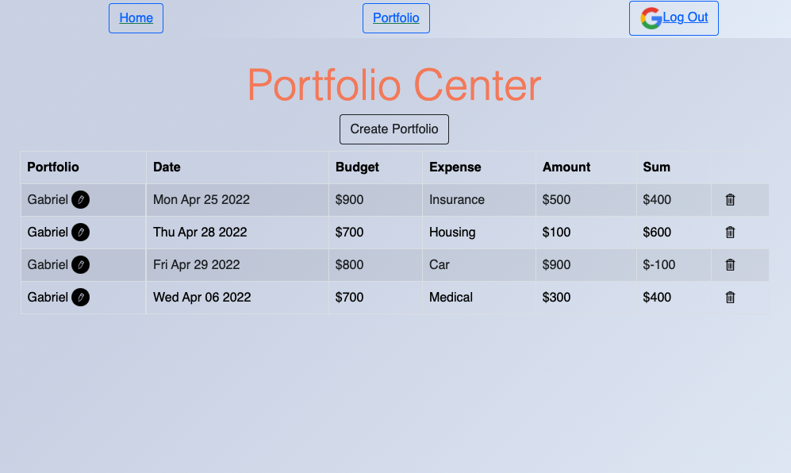
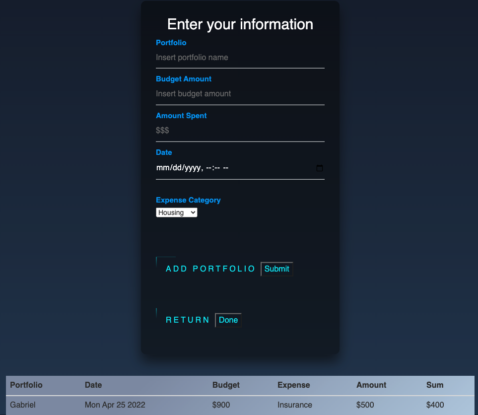

#  Finance Application:

### Create your portfolio to manage your budget & expenses. 

This application is meant as an everyday tool or end of month check. Aligning your life with your financial goals. 

This full-stack CRUD application is based on manging your finances. You begin by using a GUI with a stock model at the index page, here you are able to log in and see your portfolio. You are also able to create more portfolios, edit each one, and delete as your needs change. In order to access your personal portfolio you must sign in with your google account for security and privacy compliance. Index page contains integrated api chart for mock feature. 

- Finance App: https://finance-porfolio.herokuapp.com/
- Credit API: https://www.highcharts.com/blog/products/stock/

#### Technologies used:
> NodeJS
>
> Express
>
> MongoDB/Mongoose
>
> Google OAuth2.0
>
> Javascript
>
> EJS 
>
> CSS
>
> Boostrap
>

### Getting Started:
-  https://finance-porfolio.herokuapp.com/

#### Planned Next Steps:
- Add stocks population for portfolio access.
- Add stocks watchlist/tracker. 
- Add a GUI for multiple stocks viewable at one time.
- Add message system to be reported for budget amounts or stock prices. 
- Integrate more stock information updating in real time.
- Enhance styling layout for buttons and Index page. 